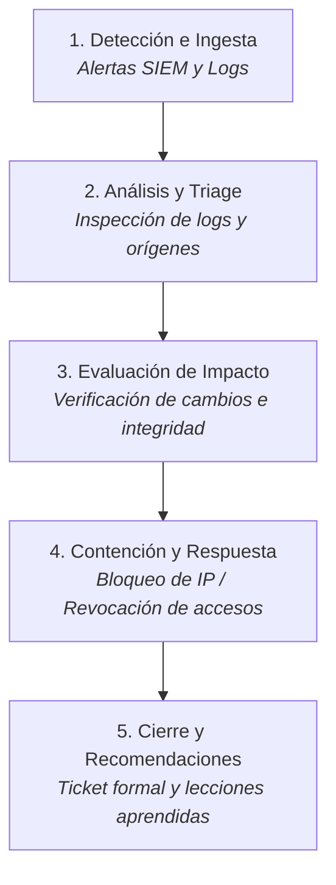

# Metodología de Monitoreo y Análisis SOC

Este documento describe el enfoque analítico y operativo aplicado en **Wazuh-SOC-Lab**, orientado a un perfil **Blue Team / SOC Tier 1 (Junior)**.

---

## Enfoque Analítico

El objetivo del laboratorio es desarrollar y demostrar capacidades defensivas fundamentales:
- **Lectura e interpretación directa de logs**: Análisis de fuentes nativas del sistema operativo (`auth.log`, `syslog`, `access.log`, Event Viewer de Windows) y logs generados por herramientas de contención (`fail2ban.log`).
- **Correlación de eventos**: Identificación de secuencias de actividad en el tiempo (por ejemplo, múltiples fallos consecutivos de autenticación previos a una acción administrativa o bloqueo).
- **Evaluación de impacto**: Determinación objetiva sobre si un evento comprometió la confidencialidad, integridad o disponibilidad de los recursos.
- **Documentación técnica estructurada**: Registro formal de hallazgos mediante tickets estandarizados para facilitar la trazabilidad y la toma de decisiones.

---

## Ciclo de Gestión de Incidentes en el Laboratorio

Para los escenarios analizados, se sigue un flujo de trabajo simplificado basado en fases estándar de respuesta a incidentes:

### 1. Detección e Ingesta
- Recolección de registros generados por los endpoints y centralizados mediante los agentes de Wazuh.
- Detección basada en reglas (detección de firmas, cambios de estado en FIM, escaneo de cumplimiento en SCA).

### 2. Análisis y Triage
- Verificación del origen del tráfico (direcciones IP internas de laboratorio o externas).
- Identificación de los servicios involucrados (SSH, HTTP/Apache, autenticación de Windows).
- Clasificación inicial de severidad (Baja, Media, Alta).

### 3. Evaluación de Impacto
- Comprobación de si existió acceso no autorizado o ejecución de privilegios.
- Verificación de alteraciones persistentes en el sistema de archivos o configuración de usuarios.

### 4. Contención y Respuesta
- **Respuesta automática**: Mecanismos locales como Fail2ban ejecutando bloqueos a nivel de firewall ante patrones reiterados de abuso.
- **Respuesta manual**: Cierre inmediato de sesiones activas (`pkill`, `kill`), revocación/rotación de credenciales comprometidas y aislamiento preventivo.

### 5. Documentación y Cierre
- Emisión del ticket de seguridad formal (ID de caso, severidad, fuentes analizadas, acciones tomadas y recomendaciones defensivas).

---

## Referencias
- Para revisar los ejercicios prácticos de detección, ver los [Laboratorios](../../labs/01-fuerza-bruta-ssh/README.md).
- Para examinar los análisis de investigación basados en tickets, ver los [Casos de Seguridad](../../casos/caso-01-actividad-sospechosa/README.md).
