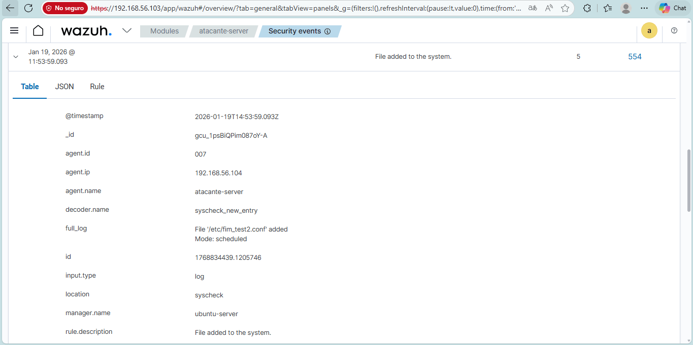
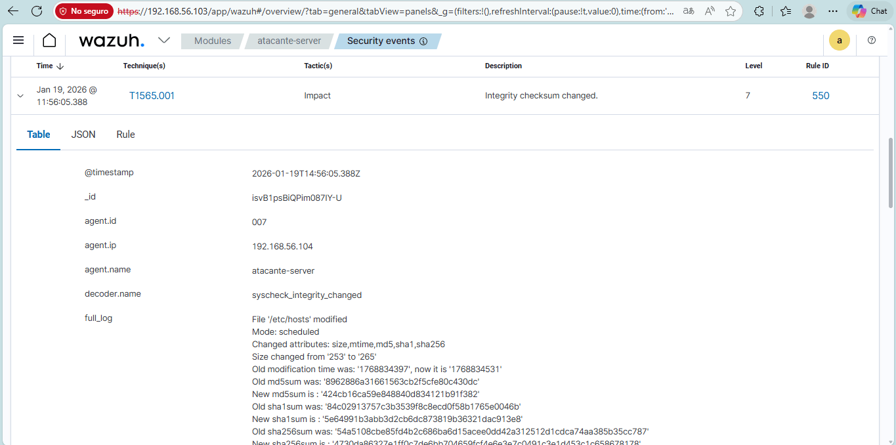

# Laboratorio 02: Monitoreo de Integridad de Archivos (FIM)

## Objetivo

Implementar y validar el módulo **File Integrity Monitoring (FIM / syscheck)** de Wazuh para supervisar rutas críticas del sistema de archivos en Linux y alertar en tiempo real ante creaciones, modificaciones o alteraciones no autorizadas.

---

## Entorno

- **Endpoint monitoreado**: Ubuntu Server (Agente Linux).
- **Ruta crítica bajo supervisión**: `/etc` (archivos de configuración del sistema).
- **Plataforma SIEM**: Wazuh 4.7.5 (Manager, Indexer, Dashboard).
- Para detalles sobre la conectividad del agente hacia el servidor Wazuh, ver [Arquitectura](../../docs/arquitectura/README.md).

---

## Procedimiento

1. **Configuración de syscheck**:
   - En el archivo de configuración del agente (`/var/ossec/etc/ossec.conf`), se habilitó y definió el directorio a auditar dentro de la etiqueta `<syscheck>`:
     ```xml
     <directories check_all="yes" realtime="yes">/etc</directories>
     ```
2. **Generación de eventos en el host Linux**:
   - **Creación de archivo**: Se creó un archivo nuevo de prueba dentro de la ruta monitoreada para simular el depósito de artefactos extraños.
   - **Modificación de archivo existente**: Se editó el contenido de un archivo previamente existente para alterar su hash criptográfico.
3. **Recepción e indexación en Wazuh**:
   - El agente procesó las alteraciones y transmitió los eventos al Wazuh Manager para su análisis y visualización en el Dashboard.

---

## Eventos Detectados y Análisis

| Evento | Descripción del Evento | Nivel / Relevancia |
|---|---|---|
| **File added to the system** | Detección de la adición de un nuevo archivo en el directorio auditado. | Identificación de posibles herramientas o archivos no autorizados añadidos al sistema. |
| **Integrity checksum changed** | Detección de cambios en el hash / contenido de un archivo existente. | Alerta inmediata ante la manipulación de configuraciones críticas en `/etc`. |

---

## Resultados

- El agente de Wazuh detectó de forma precisa y en tiempo real tanto la adición de nuevos archivos como la modificación de los checksums de archivos existentes en `/etc`.
- Las alertas fueron consolidadas e indexadas en el Wazuh Indexer y resultaron completamente visualizables desde el Wazuh Dashboard.

---

## Evidencias

Las capturas obtenidas directamente desde el Dashboard de Wazuh para este laboratorio se encuentran en el directorio de evidencias:

- **Alerta de archivo añadido al sistema (`File added to the system`)**:
  
  

- **Alerta de cambio de integridad de checksum (`Integrity checksum changed`)**:
  
  

---

## Referencias
- Laboratorio anterior: [Laboratorio 01 - Fuerza Bruta SSH](../01-fuerza-bruta-ssh/README.md).
- Siguiente laboratorio: [Laboratorio 03 - Evaluación de Configuración de Seguridad (SCA)](../03-evaluacion-configuracion-seguridad/README.md).
