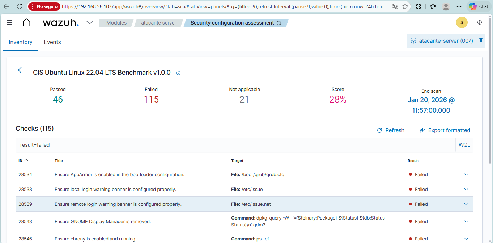
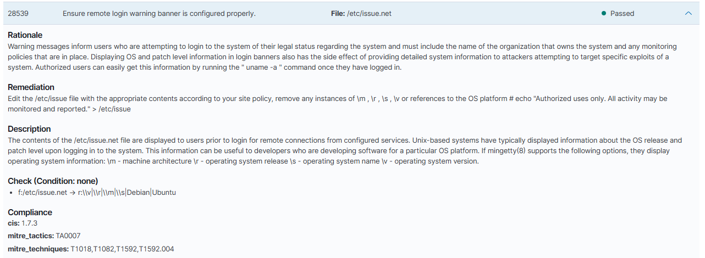
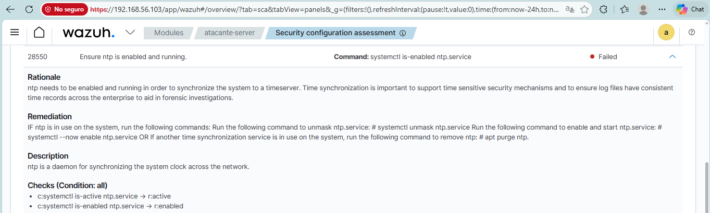
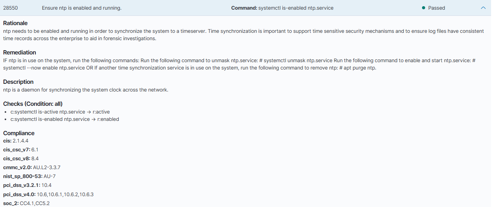

# Laboratorio 03: Evaluación de Configuración de Seguridad (SCA) y Hardening

## Objetivo

Utilizar el módulo **Security Configuration Assessment (SCA)** de Wazuh para auditar la postura de seguridad de un sistema Linux mediante políticas basadas en benchmarks de buenas prácticas (CIS), detectar configuraciones débiles o riesgosas, aplicar remediaciones técnicas de hardening y verificar su cambio de estado a cumplimiento.

---

## Entorno

- **Endpoint auditado**: Ubuntu Server (Agente Linux).
- **Módulo evaluador**: Wazuh SCA policies para Linux.
- **Plataforma SIEM**: Wazuh 4.7.5.

---

## Procedimiento de Auditoría y Remediación

1. **Escaneo inicial de SCA**:
   - Se ejecutó la auditoría de políticas de seguridad desde Wazuh en el agente Linux, detectando múltiples controles en estado **FAILED**.
2. **Selección de controles para hardening**:
   - Se priorizaron dos controles fundamentales: sincronización de tiempo y exposición de información en banners de acceso remoto.
3. **Aplicación de remediaciones**:
   - **Control 1: Time Synchronization – NTP**
     - *Check*: `Ensure ntp is enabled and running`
     - *Estado inicial*: **FAILED**
     - *Remediación técnica*: Instalación y activación del servicio `ntp` en Ubuntu Server para asegurar la sincronización y la consistencia cronológica de los registros del sistema.
     - *Estado final*: **PASSED**
   - **Control 2: Remote Login Warning Banner**
     - *Check*: `Ensure remote login warning banner is configured properly`
     - *Archivo afectado*: `/etc/issue.net`
     - *Estado inicial*: **FAILED**
     - *Remediación técnica*: Configuración de un banner genérico de advertencia sin revelar detalles del sistema operativo, versión o arquitectura para evitar fuga de información a potenciales atacantes.
     - *Estado final*: **PASSED**
4. **Reescaneo y verificación**:
   - Se forzó una nueva evaluación del módulo SCA para validar que las correcciones aplicadas fueron reconocidas por el Wazuh Manager.

---

## Resultados

- Las configuraciones deficientes identificadas inicialmente en estado **FAILED** pasaron formalmente a estado **PASSED** tras la aplicación de las medidas de hardening.
- Se comprobó la utilidad de SCA como herramienta continua de auditoría para verificar que las políticas de seguridad se mantengan en el tiempo.

---

## Evidencias

Las capturas obtenidas en el Dashboard de Wazuh documentan los estados antes y después de la remediación:

- **Escaneo inicial y falla en banner de login remoto (`Ensure remote login FAILED`)**:
  
  

- **Banner de login remoto remediado (`Ensure remote login PASSED`)**:
  
  

- **Falla en servicio de sincronización NTP (`Enable ntp FAILED`)**:
  
  

- **Servicio NTP remediado y activo (`Enable ntp PASSED`)**:
  
  

---

## Referencias
- Laboratorio anterior: [Laboratorio 02 - Monitoreo de Integridad de Archivos (FIM)](../02-monitoreo-integridad-archivos/README.md).
- Siguiente laboratorio: [Laboratorio 04 - Monitoreo de Eventos en Linux y Windows](../04-monitoreo-linux-windows/README.md).
