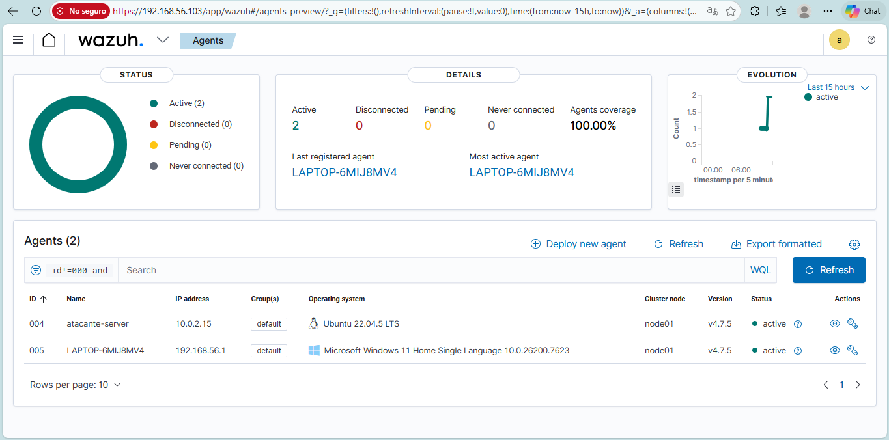
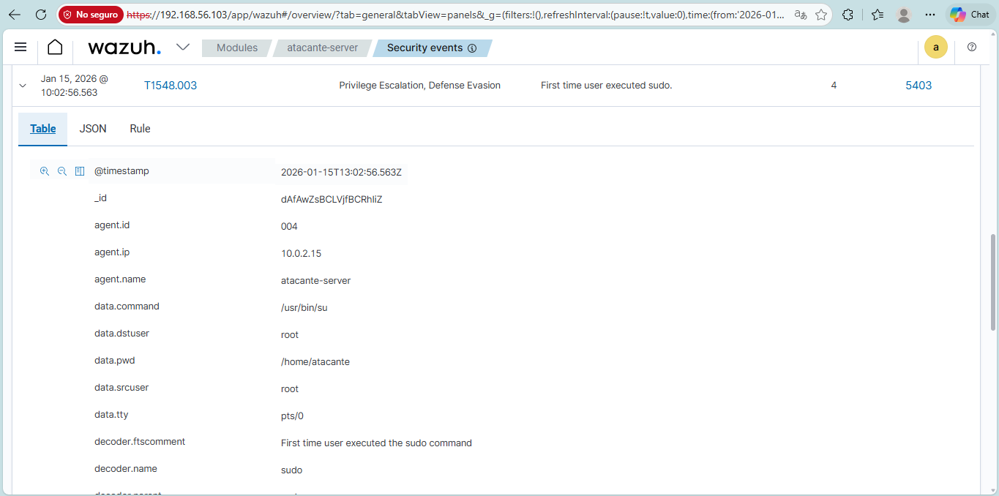
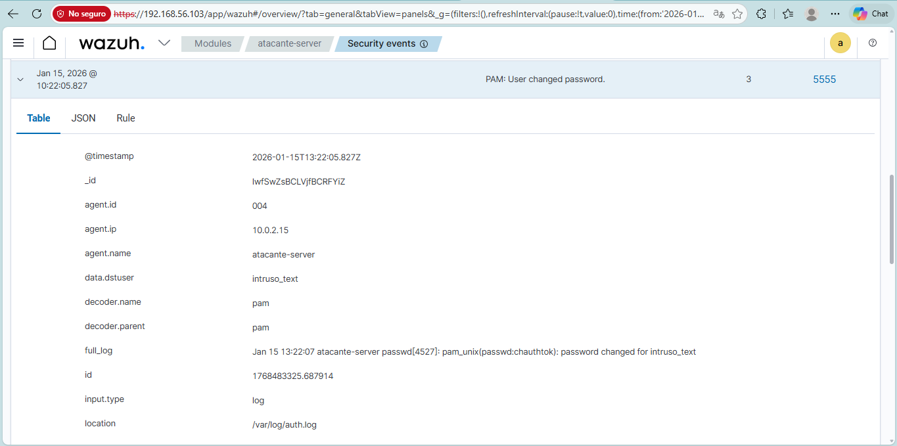
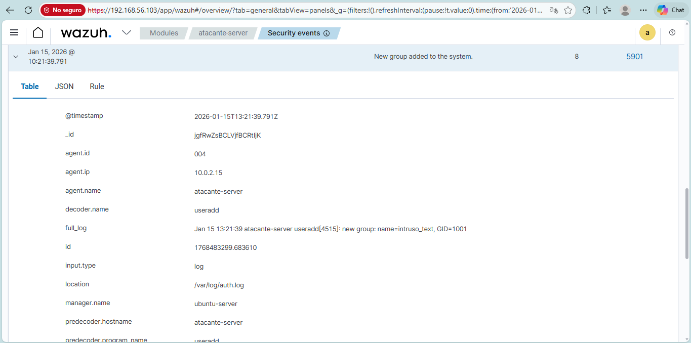
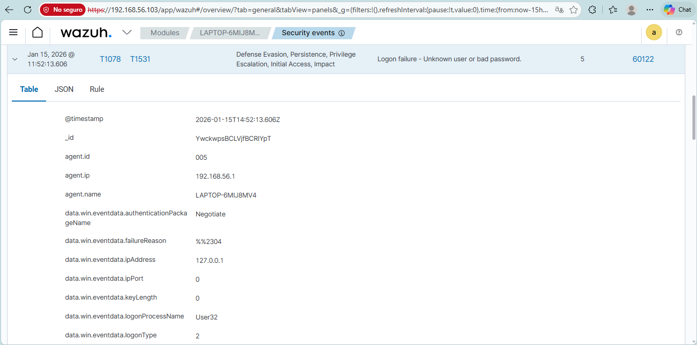
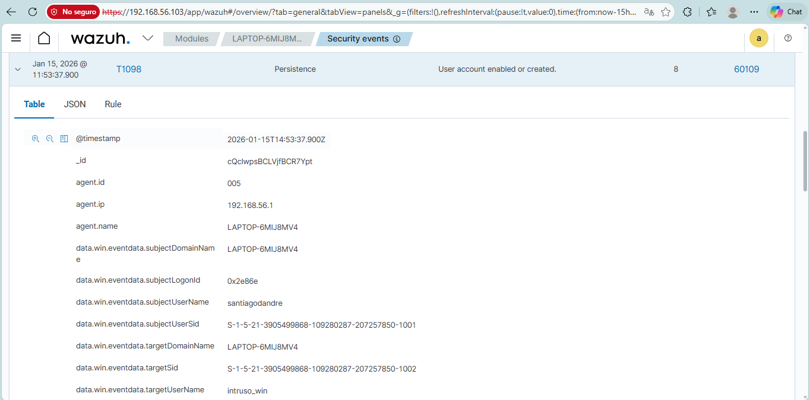
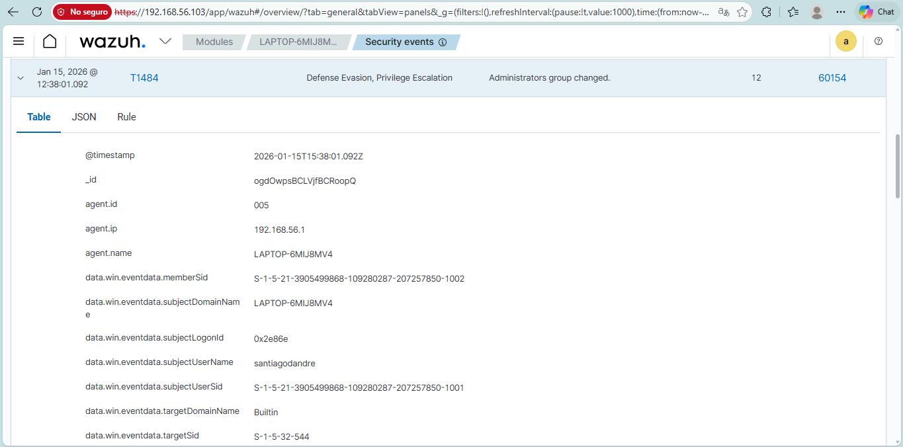

# Laboratorio 04: Monitoreo de Eventos de Seguridad en Linux y Windows

## Objetivo

Validar la recolección centralizada, decodificación y generación de alertas de seguridad en tiempo real en un entorno heterogéneo compuesto por endpoints Linux y Windows conectados a Wazuh Server.

---

## Entorno

- **Wazuh Server**: Versión 4.7.5 (Manager, Indexer, Dashboard).
- **Agente Linux**: Ubuntu Server.
- **Agente Windows**: Host Windows monitoreando el visor de eventos de seguridad.
- Para consultar la topología de red y el proceso de enrolamiento de agentes, ver [Arquitectura](../../docs/arquitectura/README.md) y [Configuración](../../docs/configuracion/README.md).

---

## Procedimiento

1. Verificación de agentes en estado **Active** desde el Dashboard de Wazuh.
2. Generación intencional de eventos de seguridad relacionados con autenticación, gestión de cuentas y privilegios en ambos sistemas.
3. Validación de las reglas de decodificación y visualización de alertas generadas en el Dashboard.

---

## Eventos y Alertas Analizadas

### 1. Sistema Linux

| Alerta | Nivel | Descripción | Relevancia en Seguridad |
|---|---|---|---|
| **First time user executed sudo** | Medio / Alto | Detección de la primera invocación del comando `sudo` por parte de un usuario. | Indicador potencial de escalada de privilegios o cambio anómalo de comportamiento en una cuenta. |
| **User changed password** | Medio | Modificación de la contraseña de un usuario local del sistema. | Registro de alteración de credenciales, relevante en investigaciones de persistencia. |
| **New group added to the system** | Alto | Creación de un nuevo grupo en el sistema operativo. | Asignación potencial de nuevos niveles de acceso o modificación de la estructura de permisos. |

### 2. Sistema Windows

| Alerta | Nivel | Descripción | Relevancia en Seguridad |
|---|---|---|---|
| **Failed logon** (Event ID 4625) | Medio | Intento de inicio de sesión fallido con credenciales incorrectas. | Detección de intentos de adivinación de contraseñas o fallos reiterados de autenticación. |
| **User created** (Event ID 4720) | Medio | Creación de una nueva cuenta de usuario local. | Actividad crítica para detectar persistencia no autorizada mediante cuentas locales secundarias. |
| **Administrator group changed** (Event ID 4728/4732) | Medio / Alto | Modificación de la membresía del grupo de Administradores local. | Indicador directo de escalada de privilegios y otorgamiento de acceso irrestricto en el host. |

---

## Resultados

- Ambos agentes enviaron registros continuos a través del canal cifrado hacia el Wazuh Manager.
- El motor de reglas correlacionó y clasificó exitosamente los eventos según su nivel de severidad.
- El equipo defensivo cuenta con visibilidad unificada de eventos críticos en ambos sistemas operativos desde una única consola.

---

## Evidencias

Las alertas analizadas en el Dashboard de Wazuh para este laboratorio se encuentran organizadas en evidencias:

### Estado de Agentes
- **Agentes activos en el Dashboard (`Lab agents`)**:
  
  

### Alertas en Linux
- **Primer uso de sudo (`Linux first time sudo alert`)**:
  
  

- **Cambio de contraseña de usuario (`Linux change password alert`)**:
  
  

- **Nuevo grupo añadido al sistema (`Linux new group added alert`)**:
  
  

### Alertas en Windows
- **Intento de inicio de sesión fallido (`Win failed logon`)**:
  
  

- **Usuario creado (`Win user created`)**:
  
  

- **Modificación en grupo Administradores (`Win admin group changed`)**:
  
  

---

## Referencias
- Laboratorio anterior: [Laboratorio 03 - Evaluación de Configuración de Seguridad (SCA)](../03-evaluacion-configuracion-seguridad/README.md).
- Casos de análisis SOC vinculados: [Casos de Seguridad](../../casos/caso-01-actividad-sospechosa/README.md).
